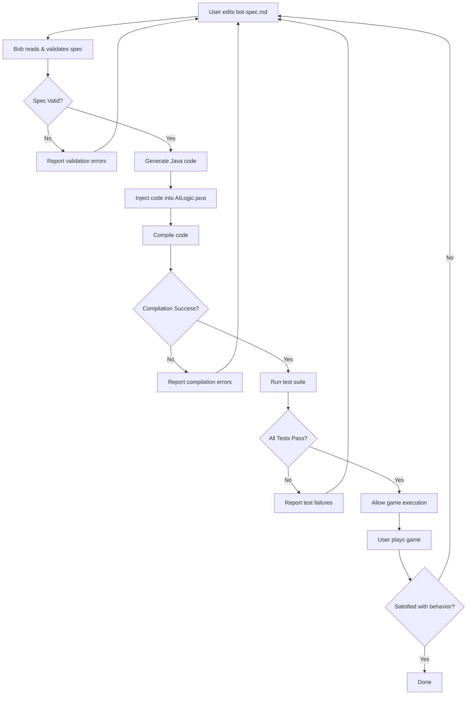

# Spec-Driven AI Bot Development Architecture

## Overview

This document outlines the architecture for a spec-driven AI bot development system for Liberty Bikes. The system allows users to define bot behavior in a structured markdown specification file, which is then automatically converted to Java code, validated through comprehensive testing, and injected into the AILogic class.

## System Architecture



## Component Design

### 1. Bot Specification Template (bot-spec.md)

**Location:** `liberty-bikes-ai/bot-spec.md`

**Purpose:** Structured markdown file where users define their bot's behavior in natural language.

**Structure:**
```markdown
# Bot Specification

## Bot Identity
- **Name:** [Bot name]
- **Strategy Type:** [Defensive/Aggressive/Balanced/Custom]
- **Version:** [1.0.0]

## Core Behavior

### Decision Making
[Describe how the bot should make decisions each game tick]

### Look-Ahead Strategy
- **Distance:** [Number of spaces to look ahead]
- **Directions:** [Which directions to evaluate]
- **Evaluation Criteria:** [What factors to consider]

### Obstacle Avoidance
[Describe how the bot should avoid obstacles]

### Risk Assessment
- **Risk Tolerance:** [Low/Medium/High]
- **Safety Margin:** [Minimum safe distance from obstacles]

## Advanced Features (Optional)

### Path Scoring
[Describe how to score different paths]

### Opponent Tracking
[Describe if/how to track other players]

### Trap Detection
[Describe how to detect and avoid traps]

## Performance Constraints
- **Max Execution Time:** 50ms per tick
- **Look-Ahead Limit:** [Max spaces to scan]

## Test Scenarios
[Describe expected behaviors in specific scenarios]
```

### 2. Spec Validator

**Location:** `liberty-bikes-ai/src/main/java/org/libertybikes/ai/validation/SpecValidator.java`

**Purpose:** Validates that bot-spec.md is complete and contains all required information.

**Validation Rules:**
- Required sections present
- Strategy type is valid
- Numeric values are within acceptable ranges
- No conflicting requirements
- Clear decision-making logic described

**Output:** Validation report with errors/warnings

### 3. Spec Parser

**Location:** `liberty-bikes-ai/src/main/java/org/libertybikes/ai/parser/SpecParser.java`

**Purpose:** Reads bot-spec.md and extracts structured data.

**Functionality:**
- Parse markdown sections
- Extract key parameters (look-ahead distance, risk tolerance, etc.)
- Build internal representation of bot behavior
- Handle optional sections gracefully

**Output:** `BotSpecification` object containing all parsed data

### 4. Code Generator

**Location:** `liberty-bikes-ai/src/main/java/org/libertybikes/ai/generator/CodeGenerator.java`

**Purpose:** Converts BotSpecification into Java code implementation.

**Generation Strategy:**
- Template-based code generation
- Modular helper method creation
- Inline documentation from spec
- Optimized algorithms based on constraints

**Output:** Generated Java code as String

### 5. Code Injector

**Location:** `liberty-bikes-ai/src/main/java/org/libertybikes/ai/injector/CodeInjector.java`

**Purpose:** Intelligently merges generated code into AILogic.java without markers.

**Injection Strategy:**
- Parse existing AILogic.java using Java parser
- Identify `processAiMove()` method
- Replace method body with generated code
- Add/update helper methods
- Preserve all core utility methods and fields
- Maintain proper formatting and imports

**Output:** Updated AILogic.java file

### 6. Test Suite Framework

**Location:** `liberty-bikes-ai/src/test/java/org/libertybikes/ai/test/`

**Purpose:** Comprehensive testing framework to validate bot behavior.

#### Test Categories:

##### A. Compilation Tests
- **File:** `CompilationTest.java`
- Verify code compiles without errors
- Check for syntax issues
- Validate imports and dependencies

##### B. Behavioral Tests
- **File:** `BehaviorTest.java`
- **Straight-line detection:** Bot must change direction within reasonable time
- **Stuck detection:** Bot must not repeatedly choose blocked paths
- **Boundary awareness:** Bot must respect board boundaries
- **Obstacle avoidance:** Bot must avoid known obstacles
- **Direction variety:** Bot must use multiple directions over time

##### C. Performance Tests
- **File:** `PerformanceTest.java`
- Execution time under 50ms per tick
- Memory usage within limits
- No infinite loops or hangs

##### D. Scenario Tests
- **File:** `ScenarioTest.java`
- Corner scenarios (bot starts in corner)
- Surrounded scenarios (limited escape routes)
- Open field scenarios (many options)
- Chase scenarios (other players nearby)

#### Test Execution:
```java
public class TestRunner {
    public TestResult runAllTests(AILogic logic) {
        TestResult result = new TestResult();
        result.add(CompilationTest.run());
        result.add(BehaviorTest.run(logic));
        result.add(PerformanceTest.run(logic));
        result.add(ScenarioTest.run(logic));
        return result;
    }
}
```

### 7. Mock Game Environment

**Location:** `liberty-bikes-ai/src/test/java/org/libertybikes/ai/test/MockGameEnvironment.java`

**Purpose:** Simulates game scenarios for testing without running full game.

**Features:**
- Create custom board states
- Simulate game ticks
- Track bot decisions over time
- Analyze movement patterns
- Detect problematic behaviors

**Example Usage:**
```java
MockGameEnvironment env = new MockGameEnvironment();
env.setBoard(TestBoards.CORNER_START);
env.addBot(aiLogic);
env.runTicks(100);
BehaviorAnalysis analysis = env.analyze();
assertTrue(analysis.changedDirection());
assertFalse(analysis.hitObstacle());
```

### 8. Behavior Analyzer

**Location:** `liberty-bikes-ai/src/test/java/org/libertybikes/ai/test/BehaviorAnalyzer.java`

**Purpose:** Analyzes bot behavior patterns to detect issues.

**Detection Algorithms:**

#### Straight-line Detection:
```java
boolean isStraightLineBot(List<DIRECTION> moves) {
    if (moves.size() < 20) return false;
    DIRECTION first = moves.get(0);
    int sameCount = 0;
    for (DIRECTION d : moves) {
        if (d == first) sameCount++;
    }
    return (sameCount / (double)moves.size()) > 0.95;
}
```

#### Stuck Detection:
```java
boolean isStuckBot(List<DIRECTION> moves) {
    // Detects repeated back-and-forth patterns
    int oscillations = 0;
    for (int i = 2; i < moves.size(); i++) {
        if (isOpposite(moves.get(i), moves.get(i-2))) {
            oscillations++;
        }
    }
    return oscillations > moves.size() * 0.3;
}
```

#### Decision Quality:
```java
double calculateDecisionQuality(List<Decision> decisions) {
    int goodDecisions = 0;
    for (Decision d : decisions) {
        if (d.avoidedObstacle && d.hadOpenPath) {
            goodDecisions++;
        }
    }
    return goodDecisions / (double)decisions.size();
}
```

## Workflow Implementation

### Phase 1: User Edits Spec
1. User opens `bot-spec.md`
2. User describes desired bot behavior
3. User can use Bob to help write/refine spec

### Phase 2: Bob Processes Spec
1. Bob reads `bot-spec.md`
2. Validates spec completeness
3. Parses spec into structured data
4. Generates Java code
5. Injects code into AILogic.java

### Phase 3: Validation
1. Compile generated code
2. Run test suite
3. Analyze behavior patterns
4. Generate test report

### Phase 4: Execution Gate
- **If tests pass:** Allow game execution
- **If tests fail:** Block execution, show detailed report
- User can iterate on spec based on feedback

## Bob Mode Integration

### Updated Workflow in bob-mode/ai-bot-builder.json:

```json
{
  "workflow": {
    "steps": [
      {
        "step": 1,
        "name": "Read Specification",
        "actions": [
          "Read bot-spec.md",
          "Validate spec structure",
          "Parse spec content"
        ]
      },
      {
        "step": 2,
        "name": "Generate Code",
        "actions": [
          "Convert spec to Java",
          "Create helper methods",
          "Add documentation"
        ]
      },
      {
        "step": 3,
        "name": "Inject Code",
        "actions": [
          "Parse AILogic.java",
          "Replace processAiMove()",
          "Update helper methods",
          "Write updated file"
        ]
      },
      {
        "step": 4,
        "name": "Test & Validate",
        "actions": [
          "Compile code",
          "Run test suite",
          "Analyze behavior",
          "Generate report"
        ]
      },
      {
        "step": 5,
        "name": "Gate Decision",
        "actions": [
          "Check all tests passed",
          "Allow/block game execution",
          "Provide feedback"
        ]
      }
    ]
  }
}
```

## Test Report Format

```markdown
# Bot Test Report

**Bot Name:** [name]
**Test Date:** [timestamp]
**Overall Status:** ✅ PASS / ❌ FAIL

## Compilation
- ✅ Code compiles successfully
- ✅ No syntax errors
- ✅ All imports resolved

## Behavioral Tests
- ✅ Direction changes detected (15 changes in 100 ticks)
- ✅ No straight-line behavior
- ✅ No stuck patterns
- ✅ Boundary awareness confirmed
- ✅ Obstacle avoidance working

## Performance Tests
- ✅ Average execution time: 2.3ms
- ✅ Max execution time: 4.1ms
- ✅ Memory usage: Normal

## Scenario Tests
- ✅ Corner start: Escaped successfully
- ✅ Surrounded: Found best path
- ✅ Open field: Made strategic choices
- ✅ Chase scenario: Avoided opponent

## Behavior Analysis
- **Decision Quality:** 87%
- **Direction Variety:** 4/4 directions used
- **Risk Management:** Appropriate
- **Path Efficiency:** Good

## Recommendation
✅ **Bot is ready for game execution**

---
*All tests passed. Bot behavior meets quality standards.*
```

## Implementation Priority

1. **High Priority (Core Functionality)**
   - bot-spec.md template
   - Spec parser
   - Code generator
   - Code injector
   - Basic compilation test

2. **Medium Priority (Quality Assurance)**
   - Behavioral tests
   - Mock game environment
   - Behavior analyzer
   - Test report generation

3. **Low Priority (Enhancements)**
   - Advanced scenario tests
   - Performance profiling
   - Spec validation UI
   - Historical test tracking

## File Structure

```
liberty-bikes-ai/
├── bot-spec.md                          # User-editable spec
├── src/
│   ├── main/
│   │   └── java/org/libertybikes/ai/
│   │       ├── AILogic.java             # Clean template (no markers)
│   │       ├── parser/
│   │       │   ├── SpecParser.java
│   │       │   └── BotSpecification.java
│   │       ├── generator/
│   │       │   ├── CodeGenerator.java
│   │       │   └── CodeTemplate.java
│   │       ├── injector/
│   │       │   └── CodeInjector.java
│   │       └── validation/
│   │           └── SpecValidator.java
│   └── test/
│       └── java/org/libertybikes/ai/test/
│           ├── TestRunner.java
│           ├── CompilationTest.java
│           ├── BehaviorTest.java
│           ├── PerformanceTest.java
│           ├── ScenarioTest.java
│           ├── MockGameEnvironment.java
│           ├── BehaviorAnalyzer.java
│           └── TestBoards.java
└── bob-mode/
    └── ai-bot-builder.json              # Updated workflow
```

## Benefits

1. **User-Friendly:** Natural language specs instead of code
2. **Quality Assurance:** Comprehensive testing prevents bad bots
3. **Iterative:** Easy to refine behavior based on test feedback
4. **Safe:** Blocks execution of problematic code
5. **Educational:** Test reports explain what works and what doesn't
6. **Maintainable:** Clean separation of concerns

## Next Steps

1. Create bot-spec.md template
2. Implement spec parser
3. Build code generator
4. Create code injector
5. Develop test suite
6. Integrate into Bob mode
7. Document workflow
8. Test end-to-end